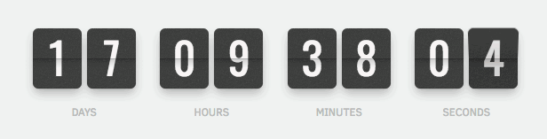

# Webpack starter kit &middot; [](https://travis-ci.org/npm/npm) [](https://www.npmjs.com/package/npm) [](http://makeapullrequest.com) [](https://github.com/your/your-project/blob/master/LICENSE)

# Таймер обратного отсчета

Создай плагин настраиваемого таймера, который ведет обратный отсчет до
предварительно определенной даты. Такой плагин может использоваться в блогах и
интернет-магазинах, страницах регистрации событий, во время технического
обслуживания и т. д.



Плагин ожидает следующую HTML-разметку и показывает четыре цифры: дни, часы,
минуты и секунды в формате `XX:XX:XX:XX`. Количество дней может состоять из
более чем двух цифр.

```html
<div class="timer" id="timer-1">
  <div class="field">
    <span class="value" data-value="days">11</span>
    <span class="label">Days</span>
  </div>

  <div class="field">
    <span class="value" data-value="hours">11</span>
    <span class="label">Hours</span>
  </div>

  <div class="field">
    <span class="value" data-value="mins">11</span>
    <span class="label">Minutes</span>
  </div>

  <div class="field">
    <span class="value" data-value="secs">11</span>
    <span class="label">Seconds</span>
  </div>
</div>
```

Плагин это класс `CountdownTimer`, экземпляр которого создает новый таймер с
настройками.

```js
new CountdownTimer({
  selector: '#timer-1',
  targetDate: new Date('Jul 17, 2019'),
});
```

Для подсчета значений используй следующие готовые формулы, где `time` - разница
между `targetDate` и текущей датой.

```js
/*
 * Оставшиеся дни: делим значение UTC на 1000 * 60 * 60 * 24, количество
 * миллисекунд в одном дне (миллисекунды * секунды * минуты * часы)
 */
const days = Math.floor(time / (1000 * 60 * 60 * 24));

/*
 * Оставшиеся часы: получаем остаток от предыдущего расчета с помощью оператора
 * остатка % и делим его на количество миллисекунд в одном часе
 * (1000 * 60 * 60 = миллисекунды * минуты * секунды)
 */
const hours = Math.floor((time % (1000 * 60 * 60 * 24)) / (1000 * 60 * 60));

/*
 * Оставшиеся минуты: получаем оставшиеся минуты и делим их на количество
 * миллисекунд в одной минуте (1000 * 60 = миллисекунды * секунды)
 */
const mins = Math.floor((time % (1000 * 60 * 60)) / (1000 * 60));

/*
 * Оставшиеся секунды: получаем оставшиеся секунды и делим их на количество
 * миллисекунд в одной секунде (1000)
 */
const secs = Math.floor((time % (1000 * 60)) / 1000);
```


## Developing

### Prerequisites

Для корректной работы SASS-компилятора и других инструментов, необходимо один
раз глобально поставить дополнительные пакеты, выполнив в терминале следующие
команды. Пользователям MacOS ничего делать не нужно.

Пользователям **Windows**, в режиме администратора.
[Как запусттить Powershell](https://youtu.be/p2tFnxcymwk) в режиме
администратора.

```shell
npm install --global --production windows-build-tools
```

Вот как выглядит процесс успешной установки для пользователей **Windows**.


Пользователям **Linux**.

```shell
sudo apt-get install gcc g++ make
```

### Setting up Dev

Для быстрого старта необходимо склонировать репозиторий.

```shell
git clone https://github.com/luxplanjay/webpack-starter-kit.git
```

Переименовать папку сборки именем вашего проекта.

```shell
mv webpack-starter-kit имя_проекта
```

Затем перейти в папку проекта.

```shell
cd имя_проекта
```

Находясь в папке проекта удалить папку `.git` связанную с репозиторием сборки
выполнив следующую команду.

```shell
npx rimraf .git
```

Установить все зависимости.

```shell
npm install
```

И запустить режим разработки.

```shell
npm start
```

Во вкладке браузера перейти по адресу
[http://localhost:4040](http://localhost:4040).

### Building

Для того чтобы создать оптимизированные файлы для хостинга, необходимо выполнить
следующую команду. В корне проекта появится папка `build` со всеми
оптимизированными ресурсами.

```shell
npm run build
```

### Deploying/Publishing

Сборка может автоматически деплоить билд на GitHub Pages удаленного (remote)
репозитория. Для этого необходимо в файле `package.json` отредактировать поле
`homepage`, заменив имя пользователя и репозитория на свои.

```json
"homepage": "https://имя_пользователя.github.io/имя_репозитория"
```

После чего в терминале выполнить следующую команду.

```shell
npm run deploy
```

Если нет ошибок в коде и свойство `homepage` указано верно, запустится сборка
проекта в продакшен, после чего содержимое папки `build` будет помещено в ветку
`gh-pages` на удаленном (remote) репозитории. Через какое-то время живую
страницу можно будет посмотреть по адресу указанному в отредактированном
свойстве `homepage`.
